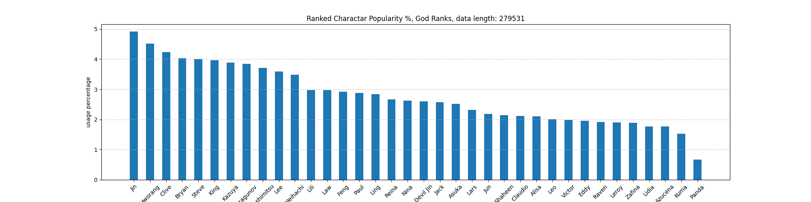

## Tekken 8 replay stats -- October 22nd to November 28th

Wrote some code to collect ranked replay data from "wavu wank" api: https://wank.wavu.wiki/api

**There are 13,481,323 replay data, with 344,144 players who have played at least one game of ranked**:
- Replays are from November 8th to December 8th 2024
- Ranked matches only

**Data is put into 3 categories**:
- All ranks
- Fujin to Tekken Emperor
- Tekken God to God of Destruction (God ranks)

**The images have the following for all of the categories above**:
- Character popularity
- Character win rates
- Character head - to - head win rates

**Rank distribution**: 
- showcasing where most matches are being played (note that this does not mean most people are ranked there.... it indicates where ranked matches are being played)

**Character popularity**
- Most popular characters at each category, expressed as a percentage

**Character Winrates**
- Overall winrates of a character, for each category

**Character head to head heatmap**
- The character on the left is the winner
- Example: Paul on the left and Law on the bottom with grid value x -> "Paul winn x% of matches against Law"

